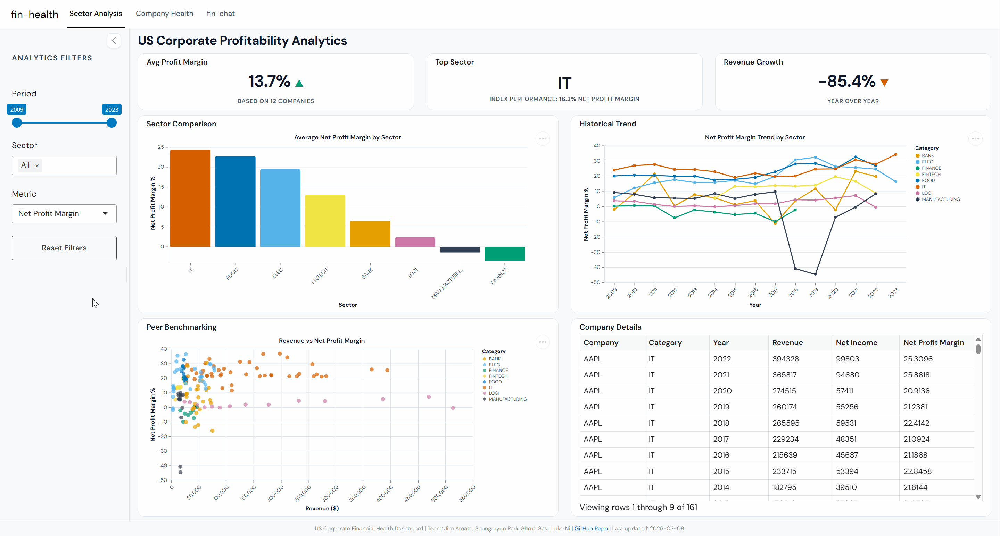

# fin-health

| | |
| --- | --- |
| CI/CD | [](https://github.com/UBC-MDS/DSCI-532_2026_33_fin-health/actions/workflows/ci.yml) [](https://github.com/UBC-MDS/DSCI-532_2026_33_fin-health/actions/workflows/docs-publish.yml) <!--[](https://codecov.io/github/UBC-MDS/DSCI-532_2026_33_fin-health)--> |
| Project | [](https://github.com/UBC-MDS/DSCI-532_2026_33_fin-health/releases) [](https://www.python.org/downloads/release/python-3120/) [](https://github.com/UBC-MDS/DSCI-532_2026_33_fin-health) |
| Meta | [](CODE_OF_CONDUCT.md) [](https://creativecommons.org/licenses/by/4.0/) [](https://opensource.org/licenses/MIT) |

## Project Synopsis

`fin-health` is an interactive dashboard that visualizes the financial health of publicly traded companies. It allows users to explore key financial metrics such as revenue, profitability, debt ratios, and cash flow across companies and time periods. fin-health supports investors and analysts in making data-driven comparisons and evaluating corporate financial performance across sectors and time.

## Motivation
Investment analysts and portfolio managers often need to compare financial performance across sectors and individual companies to support data-driven investment decisions. However, extracting insights from financial statements typically requires manually compiling data and creating ad-hoc visualizations, a process that can be both time-consuming and prone to errors.

`fin-health` addresses this challenge by providing a centralized, interactive dashboard that enables users to explore financial performance efficiently. By allowing users to filter data by time period, sector, and financial metrics, the dashboard facilitates rapid analysis of profitability trends, peer benchmarking, and key financial indicators.

## Demo

Below is a short preview of the dashboard interface.


## Features

- **Sector Analysis** — Compare profitability metrics across sectors with interactive charts and peer benchmarking
- **Company Health** — Deep dive into individual company financials with KPIs, ratio trends, and cash flow charts
- **AI Explorer** — Filter and explore the dataset using natural language powered by LLM (querychat)

## Deployment

| Build | URL |
|-------|-----|
| Stable (`main`) | [https://jiroamato-dsci-532-2026-33-fin-health-stable.share.connect.posit.cloud/](https://jiroamato-dsci-532-2026-33-fin-health-stable.share.connect.posit.cloud/) |
| Preview (`dev`) | [https://jiroamato-dsci-532-2026-33-fin-health-dev.share.connect.posit.cloud/](https://jiroamato-dsci-532-2026-33-fin-health-dev.share.connect.posit.cloud/) |

## Developer Setup

### Dependencies

-   `conda` (version 26.1.0 or higher)
-   Python and packages listed in [`requirements.txt`](requirements.txt)

For a more comprehensive guide on development guidelines for this project, check out our contributing page [here](./CONTRIBUTING.md).

1. Install [`conda`](https://docs.conda.io/projects/conda/en/latest/user-guide/install/index.html) as a prerequisite.

2. Open terminal and run the following commands.

3. Clone the repository:

```bash
git clone https://github.com/UBC-MDS/DSCI-532_2026_33_fin-health.git
cd DSCI-532_2026_33_fin-health
```

4. Create and activate the conda environment:

```bash
conda env create -f environment.yml
conda activate fin-health
```

5. Run fin-health Shiny dashboard locally:

```bash
shiny run --reload src/app.py
```

## Contributors

- Seungmyun Park
- Shruti Sasi
- Jiro Amato
- Luke Ni

## Contributing

Interested in contributing? Check out the contributing guidelines [here](./CONTRIBUTING.md). Please note that this project is released with a Code of Conduct. By contributing to this project, you agree to abide by its terms.

## License

- Copyright © 2026 Seungmyun Park, Shruti Sasi, Jiro Amato, Luke Ni

- Free software distributed under the [MIT License](./LICENSE.md).
- Documentation made available under **Creative Commons By 4.0 - Attribution 4.0 International** ([CC-BY-4.0](./LICENSE.md))
