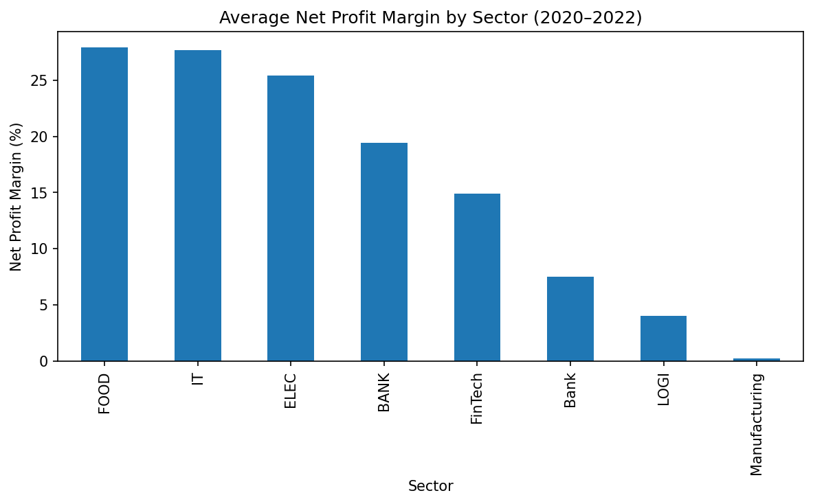
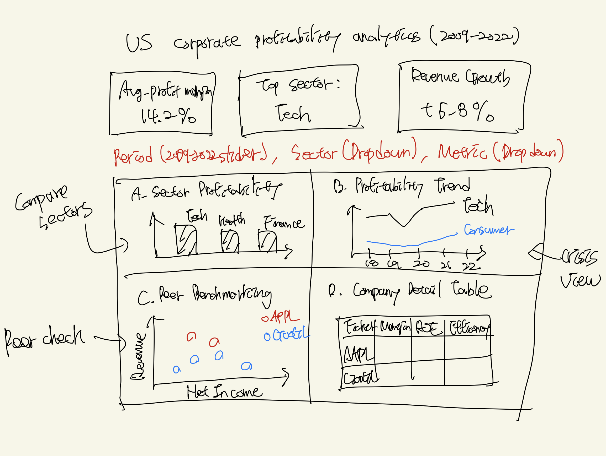

# Dashboard Proposal: US Corporate Profitability Analytics (2009–2022)

## Section 1: Motivation and Purpose

**Target Audience and Role**  
The target audience is investment analysts, portfolio managers, and financial advisors at mid-sized investment firms.  
I am acting as a data analyst supporting equity research and portfolio allocation decisions.

**Problem**  
Financial professionals must review large numbers of companies and financial reports to identify strong investment opportunities. Analyzing trends in profitability, revenue growth, and operational efficiency across multiple sectors and years is time-consuming and often performed manually using spreadsheets. This makes it difficult to quickly compare companies across industries and to understand how performance changed during major economic events such as the post-2008 recovery period and the COVID-19 pandemic. Manual workflows also increase the risk of errors and inconsistent analysis.

**Solution**  
The proposed interactive dashboard enables users to filter and compare company financial performance across sectors and time periods in a single interface. Users can identify high-performing companies using profit margins, observe revenue trends, compare operational efficiency, and benchmark companies against peers. By presenting key financial indicators through interactive charts and filters, the dashboard reduces manual analysis effort and supports faster and more reliable investment decisions.

---

## Section 2: Description of the Data

The dataset contains financial performance information for major US public companies from 2009 to 2022. This period covers multiple economic conditions, including post-crisis recovery, extended growth, and the COVID-19 shock.

**Dataset Statistics**

- Approximately a few thousand company-year observations
- Around 15–20 financial and categorical variables
- Time period: 2009–2022
- Multiple sectors, including Technology, Healthcare, Finance, and Consumer Goods

**Key Variables and Relevance**

- **Company information:** company name, ticker, and sector category, used to group and compare firms.
- **Profitability measures:** net profit margin, gross margin, operating margin, ROE, and ROA, which indicate profitability and capital efficiency.
- **Financial figures:** revenue, net income, expenses, and EBITDA, representing scale and performance.
- **Time variable:** year, enabling longitudinal analysis.
- **Operational measures:** asset turnover and expense ratios, reflecting operational efficiency.

These variables directly support the problem by enabling sector-level and company-level profitability comparison and by revealing how efficiency and performance change over time.

In addition, derived variables such as average net profit margin by sector and year will be created to support sector benchmarking and trend analysis.

---

## Section 3: Research Questions & Usage Scenarios

### User Persona

**Sarah Chen** is a senior equity analyst with eight years of experience at a $2B investment firm. She covers technology and consumer companies and prepares quarterly recommendations for portfolio managers. She prefers tools that reduce data preparation time and provide clear, presentation-ready visuals.

### Usage Scenario

Sarah is preparing for a quarterly portfolio review and must recommend sector allocation changes. She wants to identify which technology companies maintained strong profit margins from 2020 to 2022 compared with consumer companies.

Using the dashboard, she filters the data to Technology and Consumer Discretionary sectors for 2020–2022 and sorts firms by average net profit margin. She identifies several enterprise software firms that maintained margins above 25%. A time-series chart allows her to compare the top companies in each sector and observe how margins evolved year by year. She finds that consumer companies show more stable but lower margins, while technology companies exhibit higher but more volatile performance.

She then examines operational efficiency using expense ratios and observes that high-margin technology firms also show improving cost efficiency. Based on these insights, she exports a comparison chart and selects several companies for deeper research. The dashboard reduces several hours of spreadsheet analysis to a short, focused review session.

### User Stories

**Story 1 – Sector Comparison**  
When reviewing portfolio strategy, I want to compare average profitability across sectors for specific time periods so that I can identify sectors with stronger return potential.

**Story 2 – Peer Benchmarking**  
When evaluating a specific company, I want to compare its profit margins and revenue growth with its closest competitors over the past three to five years so that I can assess relative performance.

**Story 3 – Crisis Resilience Analysis**  
When assessing portfolio risk, I want to identify companies that maintained or improved profitability during the COVID-19 period so that I can construct a more defensive portfolio.

## Section 4: Exploratory Data Analysis

This section demonstrates that the dataset can directly support one of the user stories defined in Section 3.

**Selected User Story – Sector Comparison**

When reviewing portfolio strategy, I want to compare average profitability across sectors for specific time periods so that I can identify sectors with stronger return potential.

---

### Visualization 1: Average Net Profit Margin by Sector (2020–2022)

This bar chart shows the average net profit margin for each sector between 2020 and 2022.  
The values are calculated by grouping companies by the _Category_ (sector) variable and computing the mean of _Net Profit Margin_ within each sector.

This visualization enables analysts to directly compare recent profitability levels across sectors.  
By observing which sectors achieved higher average margins during the post-pandemic period, users can quickly identify sectors that offer stronger return potential and prioritize them when making portfolio reallocation decisions.

---

### Visualization 2: Sector-Level Net Profit Margin Trends (2018–2022)

This line chart shows how the average net profit margin of each sector changed from 2018 to 2022.  
Each line represents a sector and is computed by averaging company-level net profit margins within the same sector and year.

This visualization supports decision-making by revealing whether strong recent sector performance is part of a consistent trend or the result of short-term recovery effects.  
By comparing both the direction and stability of profitability across sectors, analysts can identify sectors that not only perform well but also demonstrate more reliable performance over time.

---

The full exploratory analysis and code used to generate these visualizations are available in:
`notebooks/eda_analysis.ipynb`

## Seciton 5: App Sketch & Description

The dashboard uses a single landing page that provides an overview of corporate profitability.
Users can filter the data by time period, sector, and metric, and all charts update together.
The page includes a sector comparison bar chart, a profitability trend line chart, a peer benchmarking scatter plot, and a company detail table for deeper analysis.
