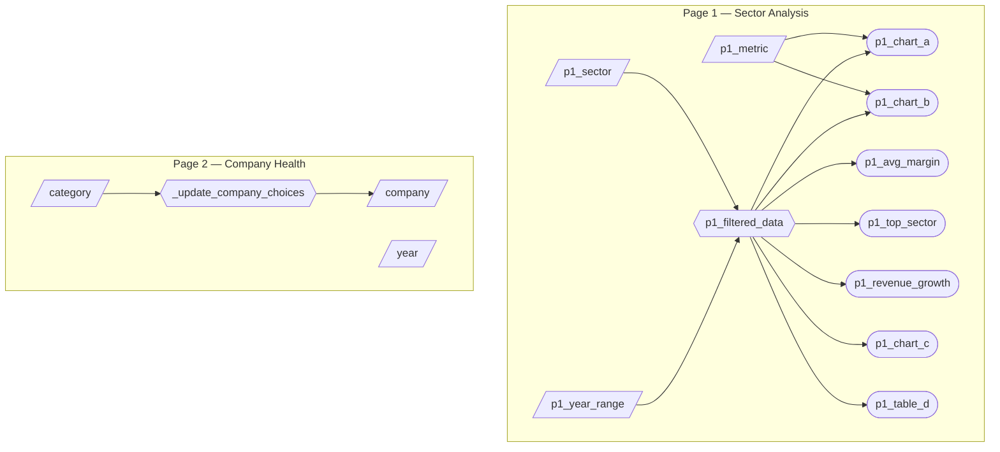

# App Specification — Milestone 2

## 2.1 Updated Job Stories

The following user stories were defined in the M1 proposal and updated here with implementation status for M2.

| # | User Story | Status | Notes |
|---|------------|--------|-------|
| 1 | When reviewing portfolio strategy, I want to compare average profitability across sectors for specific time periods so that I can identify sectors with stronger return potential. | ✅ Implemented | Sector bar chart (`p1_chart_a`) shows average of selected metric by sector; year range slider (`p1_year_range`) filters the time period; `p1_top_sector` KPI highlights the leading sector. |
| 2 | When evaluating a specific company, I want to compare its profit margins and revenue growth with its closest competitors over the past three to five years so that I can assess relative performance. | ✅ Implemented | Peer benchmarking scatter plot (`p1_chart_c`) plots Revenue vs Net Income for all companies in filtered data; company detail table (`p1_table_d`) shows individual company financials. |
| 3 | When assessing portfolio risk, I want to identify companies that maintained or improved profitability during the COVID-19 period so that I can construct a more defensive portfolio. | ✅ Implemented | Year range filter (`p1_year_range`) allows selecting 2019-2021 to isolate the COVID period; profitability trend line chart (`p1_chart_b`) shows metric trends over time by sector; `p1_revenue_growth` KPI summarizes growth direction. |
| 4 | When drilling into a specific company, I want to see its key profitability KPIs (net profit margin, ROE, revenue, net income) alongside historical revenue trends so that I can quickly assess the company's earnings performance. | ⏳ Pending M3 | Page 2 — Profitability row with KPI cards and revenue-over-time bar chart. Currently hardcoded placeholders. |
| 5 | When evaluating a company's financial stability, I want to compare its current ratio, debt/equity ratio, and cash flow breakdown so that I can gauge its liquidity and leverage risk. | ⏳ Pending M3 | Page 2 — Financial Health row with current ratio, debt/equity, and cash flow cards. Currently hardcoded placeholders. |

---

## 2.2 Component Inventory

### Page 1 — Sector Analysis

11 components: 3 inputs, 1 reactive calculation, and 7 outputs.

| ID | Type | Shiny widget / renderer | Depends on | User story |
|---|---|---|---|---|
| `p1_year_range` | Input | `ui.input_slider()` | — | #1, #3 |
| `p1_sector` | Input | `ui.input_select()` | — | #1, #2 |
| `p1_metric` | Input | `ui.input_select()` | — | #1, #3 |
| `p1_filtered_data` | Reactive calc | `@reactive.calc` | `p1_year_range`, `p1_sector` | #1, #2, #3 |
| `p1_avg_margin` | Output | `@render.text` | `p1_filtered_data` | #1 |
| `p1_top_sector` | Output | `@render.text` | `p1_filtered_data` | #1 |
| `p1_revenue_growth` | Output | `@render.text` | `p1_filtered_data` | #1 |
| `p1_chart_a` | Output | `@render_widget` (Altair) | `p1_filtered_data`, `p1_metric` | #1 |
| `p1_chart_b` | Output | `@render_widget` (Altair) | `p1_filtered_data`, `p1_metric` | #3 |
| `p1_chart_c` | Output | `@render_widget` (Altair) | `p1_filtered_data` | #2 |
| `p1_table_d` | Output | `@render.data_frame` | `p1_filtered_data` | #2 |

### Page 2 — Company Health (⏳ Pending M3)

4 components implemented in M2: 3 inputs and 1 reactive effect. Output KPIs and charts are hardcoded placeholders.

| ID | Type | Shiny widget / renderer | Depends on | User story |
|---|---|---|---|---|
| `category` | Input | `ui.input_select()` | — | #4, #5 |
| `company` | Input | `ui.input_select()` | `_update_company_choices` | #4, #5 |
| `year` | Input | `ui.input_select()` | — | #4, #5 |
| `_update_company_choices` | Reactive effect | `@reactive.effect` / `@reactive.event` | `category` | #4, #5 |

---

## 2.3 Reactivity Diagram

The diagram below shows the data flow from user inputs through reactive calculations to all outputs. Notation: parallelogram = input, hexagon = reactive calc / effect, stadium = output.

**Reactivity requirements satisfied:**
- `p1_filtered_data` is a `@reactive.calc` that depends on **2 inputs** (`p1_year_range`, `p1_sector`)
- **7 outputs** consume `p1_filtered_data`
- `p1_metric` feeds directly into `p1_chart_a` and `p1_chart_b` as an additional input

**Page 2 (M2 state):** Only the `category` → `_update_company_choices` → `company` chain is reactive. The `year` input and all output KPIs/charts are hardcoded placeholders; full reactivity will be wired in M3.

---

## 2.4 Calculation Details

### `p1_filtered_data` — Core reactive calculation (Page 1)

- **Inputs:** `p1_year_range` (slider returning `[min, max]` tuple), `p1_sector` (dropdown returning `"All"` or a specific sector name)
- **Data source:** `data/raw/financial_statement.csv` loaded into a pandas DataFrame at module level
- **Transformation:**
  1. Filter rows where `Year >= min` and `Year <= max` (from the year range slider)
  2. If `p1_sector` is not `"All"`, further filter rows where `Category == selected_sector`
  3. Return the filtered DataFrame
- **Consuming outputs:** All 7 outputs (`p1_avg_margin`, `p1_top_sector`, `p1_revenue_growth`, `p1_chart_a`, `p1_chart_b`, `p1_chart_c`, `p1_table_d`)

### `_update_company_choices` — Reactive effect (Page 2)

- **Trigger:** `category` input (fires when the user selects a different industry)
- **Transformation:** Looks up the list of companies for the selected category from `CATEGORY_COMPANIES` and calls `ui.update_select("company", ...)` to repopulate the company dropdown
- **Side effect:** Updates the `company` input choices and selects the first company

### Output calculations (Page 1)

| Output | Calculation |
|--------|-------------|
| `p1_avg_margin` | Mean of `Net Profit Margin` column from `p1_filtered_data()`, displayed with `%` unit |
| `p1_top_sector` | Sector (`Category`) with the highest mean `Net Profit Margin` from `p1_filtered_data()` |
| `p1_revenue_growth` | Percentage change in total `Revenue` between the last two years in `p1_filtered_data()`, displayed with `%` and direction sign |
| `p1_chart_a` | Bar chart of average `p1_metric` grouped by `Category` (sector) |
| `p1_chart_b` | Line chart of `p1_metric` trend over `Year`, with lines per sector |
| `p1_chart_c` | Scatter plot of `Revenue` vs `Net Income` for individual companies |
| `p1_table_d` | Table showing Company, Category, Year, Revenue, Net Income, Net Profit Margin columns |

---

## Complexity Enhancement

### Multi-Page Layout

The dashboard implements a multi-page layout using `ui.page_navbar()` with `ui.nav_panel()` tabs:

- **Page 1 — Sector Analysis:** Contains all 11 reactive components listed above. This page supports sector-level comparison and trend analysis (User Stories #1, #2, and #3).
- **Page 2 — Company Health:** A secondary page providing company-level financial health KPIs (profitability ratios, leverage ratios, cash flows). The industry → company cascading dropdown is reactive; output KPIs and charts use hardcoded placeholder values. Full reactivity planned for M3 (User Stories #4 and #5).

**UX rationale:** Separating sector-level analysis from company-level deep dives reduces cognitive load. Users first identify interesting sectors on Page 1, then drill into individual company details on Page 2. The navbar provides a clear navigation model and keeps each page focused on a single analytical task.
