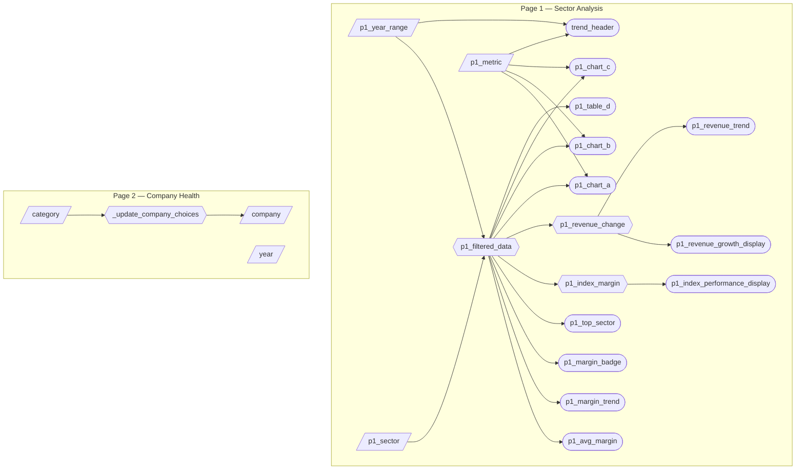

# App Specification

## Updated Job Stories

The following user stories were defined in the M1 proposal and updated here with implementation status for M2.

| # | User Story | Status | Notes |
|---|------------|--------|-------|
| 1 | When reviewing portfolio strategy, I want to compare average profitability across sectors for specific time periods so that I can identify sectors with stronger return potential. | ✅ Implemented | Sector bar chart (`p1_chart_a`) shows average of selected metric by sector; year range slider (`p1_year_range`) filters the time period; `p1_top_sector` KPI highlights the leading sector; `p1_index_performance_display` shows aggregate index net margin; `p1_margin_trend` provides a directional trend indicator. |
| 2 | When evaluating a specific company, I want to compare its profit margins and revenue growth with its closest competitors over the past three to five years so that I can assess relative performance. | ✅ Implemented | Peer benchmarking scatter plot (`p1_chart_c`) plots Revenue vs the selected metric for all companies in filtered data; company detail table (`p1_table_d`) shows individual company financials. |
| 3 | When assessing portfolio risk, I want to identify companies that maintained or improved profitability during the COVID-19 period so that I can construct a more defensive portfolio. | ✅ Implemented | Year range filter (`p1_year_range`) allows selecting 2019-2021 to isolate the COVID period; profitability trend line chart (`p1_chart_b`) shows metric trends over time by sector; `p1_revenue_growth_display` and `p1_revenue_trend` summarize year-over-year revenue growth with direction. |
| 4 | When drilling into a specific company, I want to see its key profitability KPIs (net profit margin, ROE, revenue, net income) alongside historical revenue trends so that I can quickly assess the company's earnings performance. | ⏳ Pending M3 | Page 2 — Profitability row with KPI cards and revenue-over-time bar chart. Currently hardcoded placeholders. |
| 5 | When evaluating a company's financial stability, I want to compare its current ratio, debt/equity ratio, and cash flow breakdown so that I can gauge its liquidity and leverage risk. | ⏳ Pending M3 | Page 2 — Financial Health row with current ratio, debt/equity, and cash flow cards. Currently hardcoded placeholders. |

---

## Component Inventory

### Page 1 — Sector Analysis

18 components: 3 inputs, 3 reactive calculations, and 12 outputs.

| ID | Type | Shiny widget / renderer | Depends on | User story |
|---|---|---|---|---|
| `p1_year_range` | Input | `ui.input_slider()` | — | #1, #2, #3 |
| `p1_sector` | Input | `ui.input_selectize()` | — | #1, #2 |
| `p1_metric` | Input | `ui.input_select()` | — | #1, #2, #3 |
| `p1_filtered_data` | Reactive calc | `@reactive.calc` | `p1_year_range`, `p1_sector` | #1, #2, #3 |
| `p1_index_margin` | Reactive calc | `@reactive.calc` | `p1_filtered_data` | #1 |
| `p1_revenue_change` | Reactive calc | `@reactive.calc` | `p1_filtered_data` | #1, #3 |
| `p1_avg_margin` | Output | `@render.text` | `p1_filtered_data` | #1 |
| `p1_margin_trend` | Output | `@render.ui` | `p1_filtered_data` | #1, #3 |
| `p1_margin_badge` | Output | `@render.ui` | `p1_filtered_data` | #1 |
| `p1_top_sector` | Output | `@render.text` | `p1_filtered_data` | #1 |
| `p1_index_performance_display` | Output | `@render.ui` | `p1_index_margin` | #1 |
| `p1_revenue_growth_display` | Output | `@render.ui` | `p1_revenue_change` | #1, #3 |
| `p1_revenue_trend` | Output | `@render.ui` | `p1_revenue_change` | #1, #3 |
| `trend_header` | Output | `@render.ui` | `p1_year_range`, `p1_metric` | #3 |
| `p1_chart_a` | Output | `@render_altair` | `p1_filtered_data`, `p1_metric` | #1 |
| `p1_chart_b` | Output | `@render_altair` | `p1_filtered_data`, `p1_metric` | #3 |
| `p1_chart_c` | Output | `@render_altair` | `p1_filtered_data`, `p1_metric` | #2 |
| `p1_table_d` | Output | `@render.data_frame` | `p1_filtered_data` | #2 |

> **Note:** All 18 components listed above have server-side renderers defined and are fully reactive.

### Page 2 — Company Health (⏳ Pending M3)

4 components implemented in M2: 3 inputs and 1 reactive effect. Output KPIs and charts are hardcoded placeholders.

| ID | Type | Shiny widget / renderer | Depends on | User story |
|---|---|---|---|---|
| `category` | Input | `ui.input_select()` | — | #4, #5 |
| `company` | Input | `ui.input_select()` | `_update_company_choices` | #4, #5 |
| `year` | Input | `ui.input_select()` | — | #4, #5 |
| `_update_company_choices` | Reactive effect | `@reactive.effect` / `@reactive.event` | `category` | #4, #5 |

---

## Reactivity Diagram

The diagram below shows the data flow from user inputs through reactive calculations to all outputs. Notation: parallelogram = input, hexagon = reactive calc / effect, stadium = output.

```mermaid
flowchart TD
    subgraph S1 ["Page 1 — Sector Analysis"]
        A[/p1_year_range/] --> F{{p1_filtered_data}}
        B[/p1_sector/] --> F
        F --> P3([p1_avg_margin])
        F --> P3t([p1_margin_trend])
        F --> P3b([p1_margin_badge])
        F --> P4([p1_top_sector])
        F --> IX{{p1_index_margin}}
        IX --> IXD([p1_index_performance_display])
        F --> RC{{p1_revenue_change}}
        RC --> RGD([p1_revenue_growth_display])
        RC --> RT([p1_revenue_trend])
        F --> P1([p1_chart_a])
        F --> P2([p1_chart_b])
        F --> P6([p1_chart_c])
        F --> P7([p1_table_d])
        C[/p1_metric/] --> P1
        C --> P2
        C --> P6
        A --> TH([trend_header])
        C --> TH
    end

    subgraph S2 ["Page 2 — Company Health"]
        D[/category/] --> E{{_update_company_choices}}
        E --> G[/company/]
        H[/year/]
    end
```

**Reactivity requirements satisfied:**
- `p1_filtered_data` is a `@reactive.calc` that depends on **2 inputs** (`p1_year_range`, `p1_sector`)
- **9 outputs** consume `p1_filtered_data` directly (`p1_avg_margin`, `p1_margin_trend`, `p1_margin_badge`, `p1_top_sector`, `p1_chart_a`, `p1_chart_b`, `p1_chart_c`, `p1_table_d`) plus the intermediate calcs (`p1_index_margin`, `p1_revenue_change`)
- `p1_index_margin` is a `@reactive.calc` that depends on `p1_filtered_data`; consumed by `p1_index_performance_display`
- `p1_revenue_change` is a `@reactive.calc` that depends on `p1_filtered_data`; consumed by `p1_revenue_growth_display` and `p1_revenue_trend`
- `p1_metric` feeds directly into `p1_chart_a`, `p1_chart_b`, `p1_chart_c`, and `trend_header`
- `trend_header` depends on both `p1_year_range` and `p1_metric`

**Page 2 (M2 state):** Only the `category` → `_update_company_choices` → `company` chain is reactive. The `year` input and all output KPIs/charts are hardcoded placeholders; full reactivity will be wired in M3.

---

## Calculation Details

### `p1_filtered_data` — Core reactive calculation (Page 1)

- **Inputs:** `p1_year_range` (slider returning `[min, max]` tuple), `p1_sector` (selectize dropdown returning `"All"` or a specific sector name)
- **Data source:** `data/raw/financial_statement.csv` loaded into a pandas DataFrame at module level
- **Transformation:**
  1. Filter rows where `Year >= min` and `Year <= max` (from the year range slider)
  2. If `p1_sector` is not `"All"`, further filter rows where `Category == selected_sector`
  3. Return the filtered DataFrame
- **Consuming outputs:** 8 direct outputs (`p1_avg_margin`, `p1_margin_trend`, `p1_margin_badge`, `p1_top_sector`, `p1_chart_a`, `p1_chart_b`, `p1_chart_c`, `p1_table_d`) plus 2 intermediate reactive calcs (`p1_index_margin`, `p1_revenue_change`)

### `p1_index_margin` — Reactive calculation (Page 1)

- **Input:** `p1_filtered_data`
- **Transformation:** Computes the aggregated index margin as `(Total Net Income / Total Revenue) * 100` across all rows in the filtered data
- **Consuming outputs:** `p1_index_performance_display`

### `p1_revenue_change` — Reactive calculation (Page 1)

- **Input:** `p1_filtered_data`
- **Transformation:**
  1. Group by `Year` and sum `Revenue`
  2. Sort descending by year; take the two most recent years
  3. Calculate percentage change: `(current - previous) / previous * 100`
  4. Return a dict with `value` (float) and `is_positive` (bool), or `None` if fewer than 2 years
- **Consuming outputs:** `p1_revenue_growth_display`, `p1_revenue_trend`

### `_update_company_choices` — Reactive effect (Page 2)

- **Trigger:** `category` input (fires when the user selects a different industry)
- **Transformation:** Looks up the list of companies for the selected category from `CATEGORY_COMPANIES` and calls `ui.update_select("company", ...)` to repopulate the company dropdown
- **Side effect:** Updates the `company` input choices and selects the first company

### Output calculations (Page 1)

| Output | Calculation |
|--------|-------------|
| `p1_avg_margin` | Mean of `Net Profit Margin` column from `p1_filtered_data()`, displayed with `%` unit |
| `p1_margin_trend` | Compares mean `Net Profit Margin` of the most recent year to the previous year; renders `▲` (up) or `▼` (down) trend indicator |
| `p1_margin_badge` | Displays "BASED ON {n} COMPANIES" where `n` is the count of unique companies in `p1_filtered_data()` |
| `p1_top_sector` | Sector (`Category`) with the highest mean `Net Profit Margin` from `p1_filtered_data()` |
| `p1_index_performance_display` | Displays "INDEX PERFORMANCE: {margin}% NET MARGIN" using the value from `p1_index_margin` |
| `p1_revenue_growth_display` | Displays the `p1_revenue_change` value as `+X.X%` or `-X.X%` |
| `p1_revenue_trend` | Renders `▲` or `▼` trend indicator based on `p1_revenue_change` direction |
| `trend_header` | Dynamic header text: `"Trend - {metric} ({min_year}-{max_year})"` |
| `p1_chart_a` | Bar chart of average `p1_metric` grouped by `Category` (sector) |
| `p1_chart_b` | Line chart of `p1_metric` trend over `Year`, with lines per sector |
| `p1_chart_c` | Scatter plot of `Revenue` vs selected `p1_metric` for individual companies |
| `p1_table_d` | Table showing Company, Category, Year, Revenue, Net Income, Net Profit Margin columns |

---

## Complexity Enhancement

### Multi-Page Layout

The dashboard implements a multi-page layout using `ui.page_fluid()` wrapping `ui.page_navbar()` with `ui.nav_panel()` tabs:

- **Page 1 — Sector Analysis:** Contains all 18 reactive components listed above. This page supports sector-level comparison and trend analysis (User Stories #1, #2, and #3).
- **Page 2 — Company Health:** A secondary page providing company-level financial health KPIs (profitability ratios, leverage ratios, cash flows). The industry → company cascading dropdown is reactive; output KPIs and charts use hardcoded placeholder values. Full reactivity planned for M3 (User Stories #4 and #5).

**UX rationale:** Separating sector-level analysis from company-level deep dives reduces cognitive load. Users first identify interesting sectors on Page 1, then drill into individual company details on Page 2. The navbar provides a clear navigation model and keeps each page focused on a single analytical task.

### Available Metrics

The metric selector (`p1_metric`) offers 9 metrics that drive `p1_chart_a`, `p1_chart_b`, and `p1_chart_c`:

| Metric | Unit |
|--------|------|
| Net Profit Margin | % |
| ROE | % |
| ROA | % |
| ROI | % |
| Revenue | USD |
| Net Income | USD |
| EBITDA | USD |
| Current Ratio | — |
| Debt/Equity Ratio | — |
