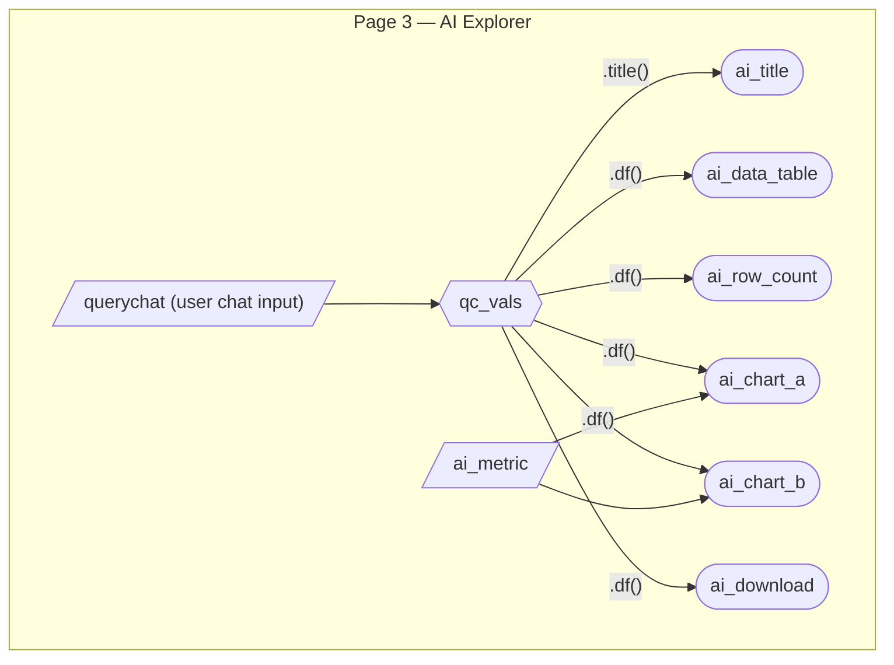
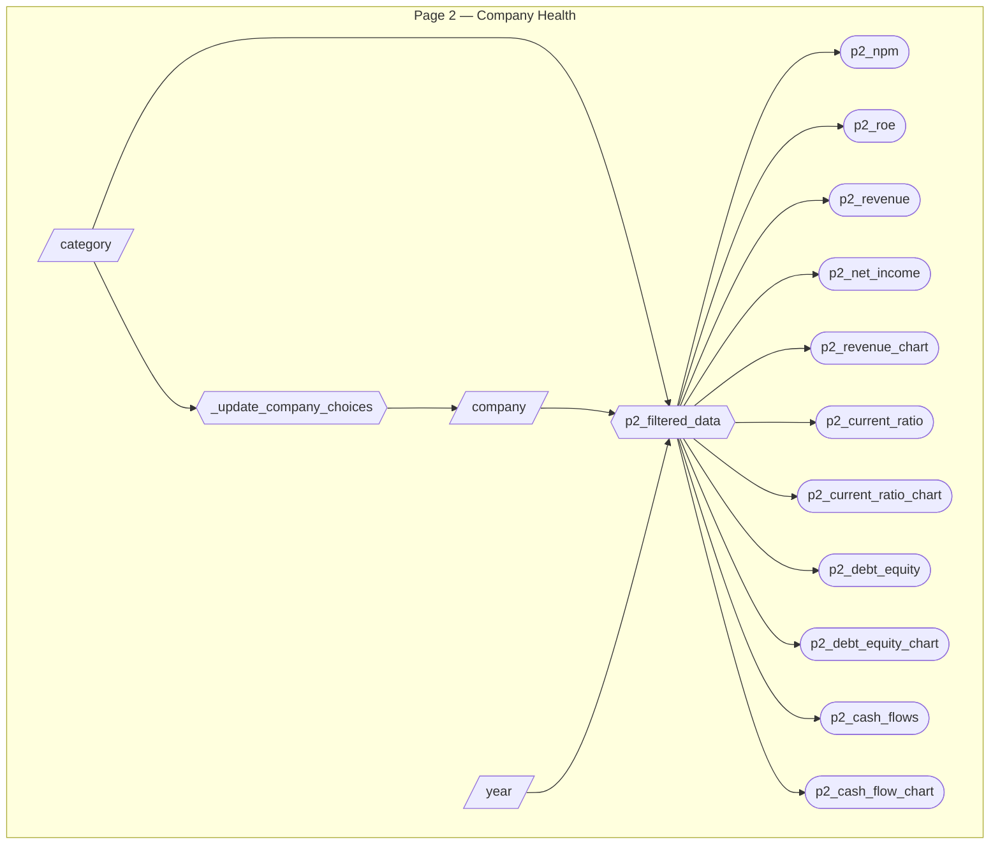

# M3 App Specification

## Overview

Milestone 3 has three objectives:

1. **Modular refactor** — decompose the monolithic `src/app.py` (639 lines) into a multi-module architecture.
2. **Page 2 completion** — replace all hardcoded placeholders on Company Health with reactive KPIs, charts, and filters.
3. **AI Explorer page** — add a new tab powered by `querychat` that lets users filter the financial dataset with natural language and view reactive visualizations + download the result.

---

## 1. Proposed File Structure

```
src/
├── app.py                  # Entry point: wires navbar, pages, footer, CSS
├── data.py                 # Data loading, cleaning, constants (CATEGORY_COMPANIES, METRIC_CHOICES, ALL_SECTORS)
├── components/
│   ├── __init__.py
│   ├── kpi_card.py         # Reusable KPI card factory
│   └── empty_chart.py      # Reusable "Data Unavailable" chart helper
├── pages/
│   ├── __init__.py
│   ├── sector.py           # Page 1 UI + server logic (Sector Analysis)
│   ├── company.py          # Page 2 UI + server logic (Company Health)
│   └── ai_explorer.py      # Page 3 UI + server logic (AI Explorer — NEW)
└── charts/
    ├── __init__.py
    └── altair_charts.py    # Pure functions that build Altair chart specs
```

### Module Responsibilities

| Module | Responsibility | Exports |
|--------|---------------|---------|
| `data.py` | Load CSV, clean columns, define `CATEGORY_COMPANIES`, `METRIC_CHOICES`, `ALL_SECTORS` | `load_data()`, `df`, constants |
| `components/kpi_card.py` | Factory function for consistent KPI cards | `kpi_card()` |
| `components/empty_chart.py` | Reusable empty-state Altair chart | `empty_chart()` |
| `charts/altair_charts.py` | Pure functions: data in → Altair spec out (no Shiny dependency) | `build_sector_bar()`, `build_metric_trend()`, `build_peer_scatter()`, `build_ai_metric_bar()`, `build_ai_trend_line()` |
| `pages/sector.py` | Page 1 UI layout + server function | `sector_ui()`, `sector_server()` |
| `pages/company.py` | Page 2 UI layout + server function | `company_ui()`, `company_server()` |
| `pages/ai_explorer.py` | Page 3 UI layout + server function (querychat) | `ai_explorer_ui()`, `ai_explorer_server()` |
| `app.py` | Compose navbar from pages, attach footer & CSS, create `App` | `app` |

---

## 2. Module Details

### 2.1 `data.py`

Extracted from current `app.py` lines 1–51. Contains:

```python
# data.py
from pathlib import Path
import pandas as pd

DATA_PATH = Path(__file__).parent.parent / "data" / "raw" / "financial_statement.csv"

def load_data(path: Path = DATA_PATH) -> pd.DataFrame:
    """Load and clean the financial dataset."""
    if not path.exists():
        raise FileNotFoundError(f"Dataset not found: {path}")
    data = pd.read_csv(path, encoding="utf-8-sig")
    data.columns = data.columns.str.strip()
    data["Category"] = data["Category"].str.upper()
    return data

df = load_data()

CATEGORY_COMPANIES = {
    "BANK": ["AIG", "BCS"],
    "ELEC": ["INTC", "NVDA"],
    "FINANCE": ["SHLDQ"],
    "FINTECH": ["PYPL"],
    "FOOD": ["MCD"],
    "IT": ["AAPL", "GOOG", "MSFT"],
    "LOGI": ["AMZN"],
    "MANUFACTURING": ["PCG"],
}
ALL_SECTORS = sorted(CATEGORY_COMPANIES.keys())

METRIC_CHOICES = {
    "Net Profit Margin": "%",
    "ROE": "%",
    "ROA": "%",
    "ROI": "%",
    "Revenue": "USD",
    "Net Income": "USD",
    "EBITDA": "USD",
    "Current Ratio": "",
    "Debt/Equity Ratio": "",
}
```

### 2.2 `components/kpi_card.py`

Replaces the 3 inline KPI card definitions with a single factory (addresses ui-report.md §2):

```python
from shiny import ui

def kpi_card(header: str, value_id: str, trend_id: str = None, label_id: str = None):
    """Build a KPI card with consistent structure."""
    value_children = [
        ui.tags.h3(
            ui.output_text(value_id, inline=True),
            class_="kpi-value", style="display: inline;",
        )
    ]
    if trend_id:
        value_children.append(ui.output_ui(trend_id, style="display: inline;"))

    label_row = ui.tags.div(
        ui.output_ui(label_id) if label_id else ui.tags.span(),
        class_="kpi-label-row",
    )
    return ui.card(
        ui.card_header(header),
        ui.tags.div(*value_children, class_="kpi-value-row"),
        label_row,
    )
```

### 2.3 `components/empty_chart.py`

Replaces 3 identical copy-pasted blocks (addresses ui-report.md §3):

```python
import altair as alt
import pandas as pd

def empty_chart(message: str = "Data Unavailable") -> alt.Chart:
    """Return a text-only Altair chart for empty-state fallback."""
    return (
        alt.Chart(pd.DataFrame({"text": [message]}))
        .mark_text(size=18)
        .encode(text="text:N")
    )
```

### 2.4 `charts/altair_charts.py`

Pure functions — no Shiny imports. Each takes a DataFrame + parameters, returns an `alt.Chart`. This makes them unit-testable without a Shiny runtime.

Functions to extract from current server logic:

| Function | Current location | Description |
|----------|-----------------|-------------|
| `build_sector_bar(data, metric, unit)` | `p1_chart_a` | Bar chart of avg metric by sector |
| `build_metric_trend(data, metric, unit)` | `p1_chart_b` | Line chart of metric over time by sector |
| `build_peer_scatter(data, metric, unit)` | `p1_chart_c` | Scatter of Revenue vs metric |
| `build_revenue_over_time(data, company)` | NEW (Page 2) | Bar chart of yearly revenue for a single company |
| `build_ratio_over_time(data, company, metric)` | NEW (Page 2) | Line chart of Current Ratio or Debt/Equity over time |
| `build_cash_flows(data, company)` | NEW (Page 2) | Grouped bar chart of Operating, Investing, Financing cash flows |
| `build_ai_metric_bar(data, metric, unit)` | NEW | Bar chart for AI Explorer (reuses `build_sector_bar` logic) |
| `build_ai_trend_line(data, metric, unit)` | NEW | Trend line for AI Explorer (reuses `build_metric_trend` logic) |

The AI Explorer charts can call the same underlying functions with the querychat-filtered dataframe.

### 2.5 `pages/sector.py`

Extracted from current `app.py`. Exports:

- `sector_ui()` — returns the full Page 1 layout (sidebar + KPI row + chart row + peer row)
- `sector_server(input, output, session)` — contains all Page 1 reactive calcs and renderers

Imports `df`, constants from `data.py`; `kpi_card` from components; chart builders from `charts/`.

### 2.6 `pages/company.py`

Extracted from current `app.py`. Exports:

- `company_ui()` — returns the full Page 2 layout
- `company_server(input, output, session)` — contains Page 2 reactive logic

Imports `df`, `CATEGORY_COMPANIES`, `ALL_SECTORS` from `data.py`; chart builders from `charts/`.

Detailed spec below in §4.

### 2.7 `pages/ai_explorer.py` (NEW)

This is the core M3 feature. Detailed spec below in §3.

### 2.8 `app.py` (refactored entry point)

Reduced to ~40 lines — just composition:

```python
from pathlib import Path
import subprocess
from shiny import App, ui
from pages.sector import sector_ui, sector_server
from pages.company import company_ui, company_server
from pages.ai_explorer import ai_explorer_ui, ai_explorer_server

CSS_PATH = Path(__file__).parent.parent / "assets" / "custom_styles.css"
with open(CSS_PATH, "r") as f:
    CUSTOM_CSS = ui.tags.style(f.read())

navbar = ui.page_navbar(
    ui.nav_panel("Sector Analysis", sector_ui()),
    ui.nav_panel("Company Health", company_ui()),
    ui.nav_panel("AI Explorer", ai_explorer_ui()),
    title="fin-health",
    id="main_nav",
    fillable=True,
)

footer = ui.tags.footer(...)  # same as current

app_ui = ui.page_fluid(CUSTOM_CSS, navbar, footer)

def server(input, output, session):
    sector_server(input, output, session)
    company_server(input, output, session)
    ai_explorer_server(input, output, session)

app = App(app_ui, server)
```

---

## 3. AI Explorer Page — Feature Spec

### 3.1 Purpose

The LLM acts as a **natural-language data filter**. Users type queries like *"Show tech companies with profit margin above 20%"* and the LLM translates them into pandas filter operations. The filtered dataframe then drives visualizations and can be downloaded.

### 3.2 User Stories

| # | User Story | Components |
|---|-----------|------------|
| 6 | When exploring the dataset, I want to ask natural-language questions to filter companies so that I can quickly isolate subsets without manually configuring dropdowns. | `querychat` sidebar, `ai_data_table` |
| 7 | When I find an interesting data subset via AI filtering, I want to see visualizations update automatically so that I can visually assess the filtered companies. | `ai_chart_a`, `ai_chart_b` |
| 8 | When I have filtered data that I want to analyze offline, I want to download it as a CSV so that I can use it in other tools. | `ai_download` |

### 3.3 Layout

```
┌─────────────────────────────────────────────────────────────┐
│  Sidebar (querychat)       │  Main Content                  │
│                            │                                │
│  ┌──────────────────────┐  │  ┌────────────────────────────┐│
│  │  Chat interface      │  │  │  Card: Filtered Data       ││
│  │  (qc.sidebar())      │  │  │  ┌──────────────────────┐  ││
│  │                      │  │  │  │ ai_data_table        │  ││
│  │  User types query    │  │  │  │ (output_data_frame)  │  ││
│  │  LLM filters data    │  │  │  └──────────────────────┘  ││
│  │                      │  │  │  [Download CSV]            ││
│  │                      │  │  └────────────────────────────┘│
│  │                      │  │                                │
│  │                      │  │  ┌─────────────┬──────────────┐│
│  │                      │  │  │ ai_chart_a  │ ai_chart_b   ││
│  │                      │  │  │ Sector bar  │ Metric trend ││
│  └──────────────────────┘  │  └─────────────┴──────────────┘│
└─────────────────────────────────────────────────────────────┘
```

### 3.4 Component Inventory — Page 3

10 components: 1 querychat instance, 1 reactive calc, 4 outputs, 1 input (metric selector), 1 download handler, and 2 querychat-managed reactives.

| ID | Type | Widget / Renderer | Depends on | User story |
|---|---|---|---|---|
| `qc` | QueryChat instance | `querychat.QueryChat()` | — | #6 |
| `qc_vals` | Reactive (managed by querychat) | `qc.server()` → `.df()`, `.title()` | user chat input | #6 |
| `ai_metric` | Input | `ui.input_selectize()` | — | #7 |
| `ai_title` | Output | `@render.text` | `qc_vals.title()` | #6 |
| `ai_data_table` | Output | `@render.data_frame` | `qc_vals.df()` | #6 |
| `ai_chart_a` | Output | `@render_altair` | `qc_vals.df()`, `ai_metric` | #7 |
| `ai_chart_b` | Output | `@render_altair` | `qc_vals.df()`, `ai_metric` | #7 |
| `ai_row_count` | Output | `@render.text` | `qc_vals.df()` | #6 |
| `ai_download` | Download | `@render.download` | `qc_vals.df()` | #8 |

### 3.5 QueryChat Configuration

```python
import querychat
from chatlas import ChatGithub
from data import df

DATA_DESCRIPTION = """
US Corporate financial statement data (2009–2023), covering 12 publicly
traded companies across 8 sectors.

Column descriptions:
- Year: fiscal year (2009–2023)
- Company: ticker symbol (AAPL, GOOG, MSFT, AMZN, INTC, NVDA, PYPL, MCD, AIG, BCS, SHLDQ, PCG)
- Category: sector (BANK, ELEC, FINANCE, FINTECH, FOOD, IT, LOGI, MANUFACTURING)
- Market Cap(in B USD): market capitalization in billions
- Revenue: annual revenue in millions USD
- Gross Profit: gross profit in millions USD
- Net Income: net income in millions USD
- Earning Per Share: earnings per share in USD
- EBITDA: earnings before interest, taxes, depreciation, and amortization in millions USD
- Share Holder Equity: total shareholder equity in millions USD
- Cash Flow from Operating: operating cash flow in millions USD
- Cash Flow from Investing: investing cash flow in millions USD
- Cash Flow from Financial Activities: financing cash flow in millions USD
- Current Ratio: current assets / current liabilities (>1 = healthy liquidity)
- Debt/Equity Ratio: total debt / shareholder equity
- ROE: return on equity (%)
- ROA: return on assets (%)
- ROI: return on investment (%)
- Net Profit Margin: net income / revenue (%)
- Free Cash Flow per Share: free cash flow per share in USD
- Return on Tangible Equity: return on tangible equity (%)
- Number of Employees: headcount
- Inflation Rate(in US): US inflation rate for that year (%)
"""

GREETING = """
Hi! I can help you explore the financial dataset. Try one of these:

* <span class="suggestion">Show tech companies with profit margin above 20%</span>
* <span class="suggestion">Compare all companies in 2022</span>
* <span class="suggestion">Filter to banks with high debt/equity ratio</span>
* <span class="suggestion">Which company had the highest ROE?</span>
"""

qc = querychat.QueryChat(
    df,
    "financial_data",
    data_description=DATA_DESCRIPTION,
    greeting=GREETING,
    client=ChatGithub(model="gpt-4.1-mini"),
)
```

### 3.6 Reactivity Diagram — Page 3



### 3.7 Download Button

```python
@render.download(filename="filtered_financial_data.csv")
def ai_download():
    filtered = qc_vals.df()
    yield filtered.to_csv(index=False)
```

### 3.8 Visualization Details

Both charts reuse logic from `charts/altair_charts.py`:

| Chart | Function | Description |
|-------|----------|-------------|
| `ai_chart_a` | `build_sector_bar(data, metric, unit)` | Bar chart of average metric by sector for the AI-filtered data |
| `ai_chart_b` | `build_metric_trend(data, metric, unit)` | Line chart of metric trend over time for the AI-filtered data |

Both fall back to `empty_chart()` when the filtered dataframe is empty.

### 3.9 LLM Client & Deployment

- **Development:** Uses `ChatGithub(model="gpt-4.1-mini")` via a GitHub PAT stored in `.env`
- **Deployment:** The GitHub PAT is set as an environment variable on Posit Connect Cloud
- **Rate limits:** `gpt-4.1-mini` via GitHub Models is free-tier; monitor token usage during development
- **Fallback:** Can swap to another `chatlas` provider (e.g., `ChatOpenAI`, `ChatAnthropic`) by changing one line

---

## 4. Page 2 — Company Health Feature Spec

### 4.1 Purpose

Page 2 provides a single-company deep dive into profitability and financial health. Currently all values are hardcoded placeholders — the goal is to replace every placeholder with reactive outputs driven by sidebar filters.

### 4.2 User Stories

| # | User Story | Components |
|---|-----------|------------|
| 3 | When I select an industry and company, I want to see that company's profitability KPIs so that I can assess its earnings performance. | `p2_npm`, `p2_roe`, `p2_rev_income` |
| 4 | When I select a company, I want to see its revenue trend over time so that I can identify growth patterns. | `p2_revenue_chart` |
| 5 | When I select a company, I want to see its liquidity ratios and cash flow breakdown so that I can evaluate financial stability. | `p2_current_ratio`, `p2_debt_equity`, `p2_cash_flows` |

### 4.3 Layout

```
┌─────────────────────────────────────────────────────────────────┐
│  Sidebar                  │  Main Content                       │
│  ┌─────────────────────┐  │                                     │
│  │ Industry (select)   │  │  PROFITABILITY                      │
│  │ Company  (select)   │  │  ┌─────────┬─────────┬──────────┬──────────┐
│  │ Year     (select)   │  │  │Net Profit│  ROE    │ Rev &    │ Revenue  │
│  │                     │  │  │ Margin   │         │ Net Inc  │ Over Time│
│  │                     │  │  │  KPI     │  KPI    │  KPI     │  Chart   │
│  │                     │  │  └─────────┴─────────┴──────────┴──────────┘
│  │                     │  │                                     │
│  │                     │  │  FINANCIAL HEALTH                   │
│  │                     │  │  ┌───────────┬───────────┬─────────┐│
│  │                     │  │  │ Current   │ Debt/     │ Cash    ││
│  │                     │  │  │ Ratio KPI │ Equity KPI│ Flows   ││
│  │                     │  │  │ + line    │ + line    │ KPI +   ││
│  │                     │  │  │ chart     │ chart     │ grouped ││
│  │                     │  │  │           │           │ bar     ││
│  └─────────────────────┘  │  └───────────┴───────────┴─────────┘│
└─────────────────────────────────────────────────────────────────┘
```

### 4.4 Component Inventory — Page 2

3 inputs, 1 reactive calc, 7 KPI outputs, 4 chart outputs, 1 reactive effect.

| ID | Type | Widget / Renderer | Depends on | User story |
|---|---|---|---|---|
| `category` | Input | `ui.input_select()` | — | #3 |
| `company` | Input | `ui.input_select()` | `category` (choices updated dynamically) | #3 |
| `year` | Input | `ui.input_select()` | — | #3 |
| `_update_company_choices` | Effect | `@reactive.effect` | `category` | #3 |
| `p2_filtered_data` | Reactive calc | `@reactive.calc` | `category`, `company`, `year` | #3 |
| `p2_npm` | Output | `@render.text` | `p2_filtered_data` | #3 |
| `p2_roe` | Output | `@render.text` | `p2_filtered_data` | #3 |
| `p2_revenue` | Output | `@render.text` | `p2_filtered_data` | #3 |
| `p2_net_income` | Output | `@render.text` | `p2_filtered_data` | #3 |
| `p2_current_ratio` | Output | `@render.text` | `p2_filtered_data` | #5 |
| `p2_debt_equity` | Output | `@render.text` | `p2_filtered_data` | #5 |
| `p2_cash_flows` | Output | `@render.ui` | `p2_filtered_data` | #5 |
| `p2_revenue_chart` | Output | `@render_altair` | `p2_filtered_data` | #4 |
| `p2_current_ratio_chart` | Output | `@render_altair` | `p2_filtered_data` | #5 |
| `p2_debt_equity_chart` | Output | `@render_altair` | `p2_filtered_data` | #5 |
| `p2_cash_flow_chart` | Output | `@render_altair` | `p2_filtered_data` | #5 |

### 4.5 Reactivity Diagram — Page 2



### 4.6 Reactive Calc — `p2_filtered_data`

```python
@reactive.calc
def p2_filtered_data():
    """Filter dataset by selected category, company, and year."""
    category = input.category()
    company = input.company()
    year = int(input.year())

    filtered = df[
        (df["Category"] == category)
        & (df["Company"] == company)
        & (df["Year"] == year)
    ]
    return filtered
```

### 4.7 KPI Outputs

| KPI | Column(s) | Format | Section |
|-----|-----------|--------|---------|
| Net Profit Margin | `Net Profit Margin` | `f"{value:.1f}%"` | Profitability |
| ROE | `ROE` | `f"{value:.2f}%"` | Profitability |
| Revenue | `Revenue` | `f"${value:,.0f}M"` | Profitability |
| Net Income | `Net Income` | `f"${value:,.0f}M"` | Profitability |
| Current Ratio | `Current Ratio` | `f"{value:.2f}"` | Financial Health |
| Debt/Equity Ratio | `Debt/Equity Ratio` | `f"{value:.2f}"` | Financial Health |
| Cash Flows | `Cash Flow from Operating`, `Cash Flow from Investing`, `Cash Flow from Financial Activities` | `f"${value:,.0f}M"` each | Financial Health |

### 4.8 Chart Specifications

| Chart | Function | Data | Description |
|-------|----------|------|-------------|
| `p2_revenue_chart` | `build_revenue_over_time(data, company)` | All years for selected company | Bar chart — yearly revenue, x=Year, y=Revenue |
| `p2_current_ratio_chart` | `build_ratio_over_time(data, company, "Current Ratio")` | All years for selected company | Line chart — Current Ratio over time |
| `p2_debt_equity_chart` | `build_ratio_over_time(data, company, "Debt/Equity Ratio")` | All years for selected company | Line chart — Debt/Equity Ratio over time |
| `p2_cash_flow_chart` | `build_cash_flows(data, company)` | All years for selected company | Grouped bar — Operating, Investing, Financing by year |

Note: Chart functions receive **all years** for the selected company (not filtered by `year`), so trends are visible. The `year` filter only affects KPI values.

All charts fall back to `empty_chart()` when the filtered data is empty.

---

## 5. New Dependencies

| Package | Purpose | Add to |
|---------|---------|--------|
| `querychat` | LLM-powered dataframe filtering for Shiny | `requirements.txt`, `environment.yml` |
| `chatlas` | Unified LLM client interface | `requirements.txt`, `environment.yml` |
| `python-dotenv` | Load `.env` for API keys | `requirements.txt`, `environment.yml` |

---

## 6. Updated Test Strategy

With chart and data logic extracted into pure functions, tests no longer need a Shiny runtime:

```python
# tests/test_data.py — data loading tests (migrated from test_app.py)
from data import df, load_data
# test_data_loaded_successfully, test_expected_columns_present

# tests/test_charts.py — chart builder tests (NEW)
from charts.altair_charts import build_sector_bar, build_metric_trend, build_peer_scatter
# test each returns an alt.Chart, test empty data returns empty_chart

# tests/test_components.py — component factory tests (NEW)
from components.kpi_card import kpi_card
# test returns a Shiny UI element
```

---

## 7. CSS Fixes (from ui-report.md)

These should be addressed during the refactor:

| Fix | Priority | Detail |
|-----|----------|--------|
| Remove duplicate `.kpi-label` rule | P1 | Keep only the second definition (0.9em) |
| Remove duplicate `.section-label` rule | P1 | Consolidate into one |
| Scope wildcard `*` transition | P2 | Replace `*` selector with specific interactive elements |
| Define `--primary-light` variable | P2 | Add to `:root` block |
| Remove unused CSS classes | P2 | `.progress-bar-container`, `.progress-bar-fill`, `.status-badge`, `.metric-change`, `.label-wrapper`, `.kpi-big` |
| Use CSS variables in section labels | P3 | Replace hardcoded `#2980b9`, `#c0392b` with variables |

---

## 8. Migration Checklist

The refactor should be done in order to minimize breakage:

- [ ] Create `src/data.py` — extract data loading and constants from `app.py`
- [ ] Create `src/components/` — extract `kpi_card()` and `empty_chart()`
- [ ] Create `src/charts/altair_charts.py` — extract pure chart builder functions
- [ ] Create `src/pages/sector.py` — extract Page 1 UI + server
- [ ] Create `src/pages/company.py` — extract Page 2 UI + server
- [ ] Implement Page 2 reactive KPIs and charts (replace all hardcoded placeholders)
- [ ] Create `src/pages/ai_explorer.py` — implement new AI Explorer page
- [ ] Refactor `src/app.py` — reduce to entry-point composition only
- [ ] Update `tests/` — migrate and expand tests for new module structure
- [ ] Apply CSS fixes from §7
- [ ] Add `querychat`, `chatlas`, `python-dotenv` to `requirements.txt` and `environment.yml`
- [ ] Set `GITHUB_TOKEN` env var on Posit Connect Cloud for deployment
- [ ] Update `CHANGELOG.md` with `[0.3.0]` entry
